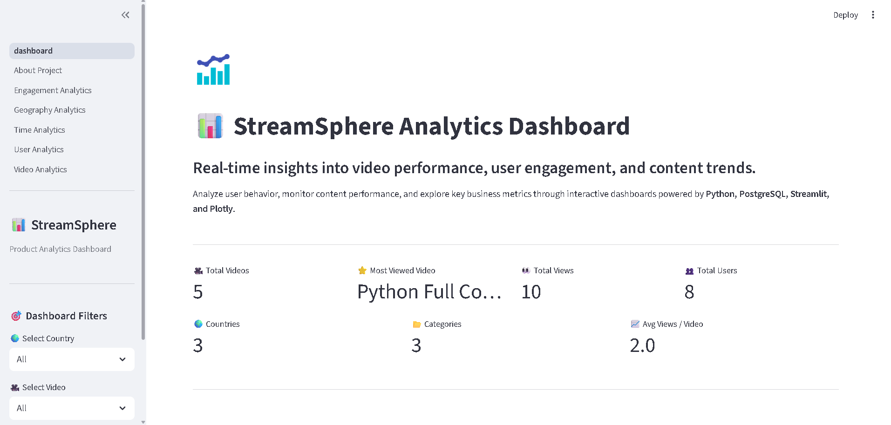
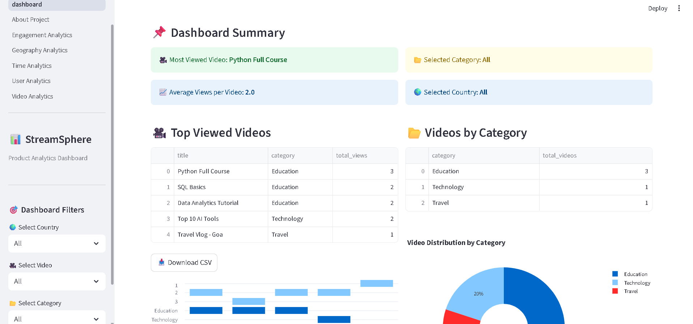
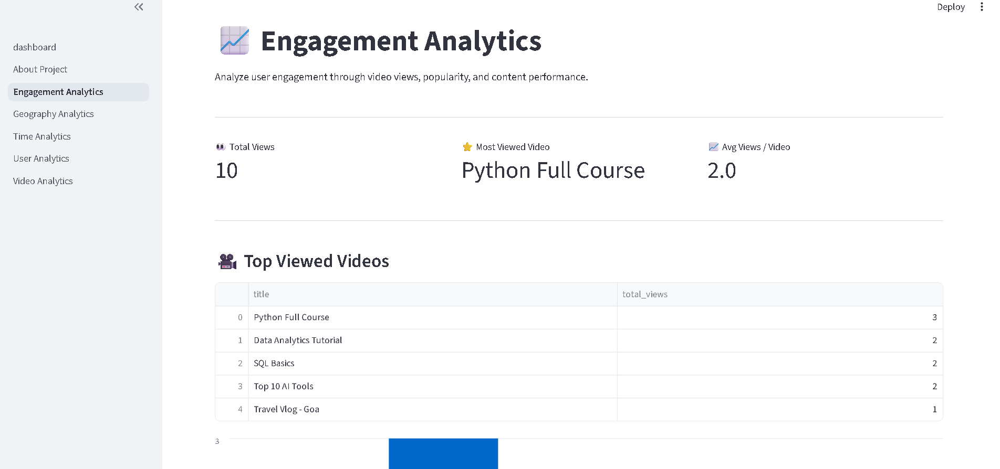
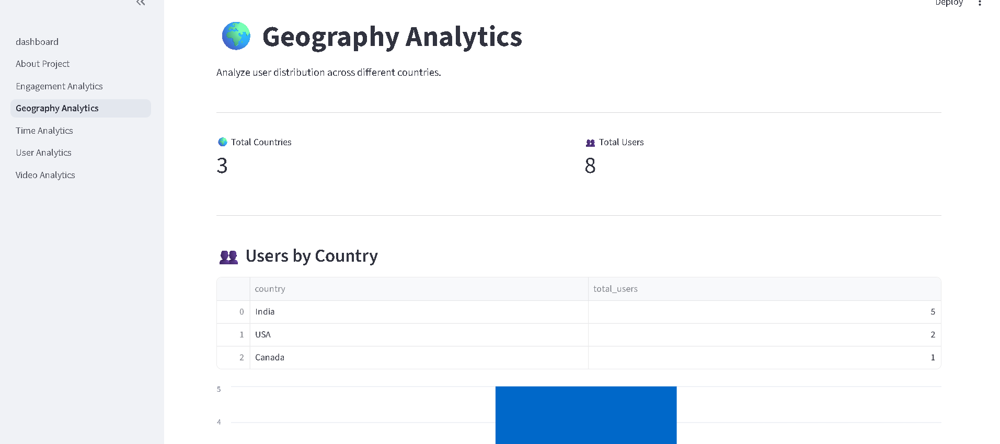
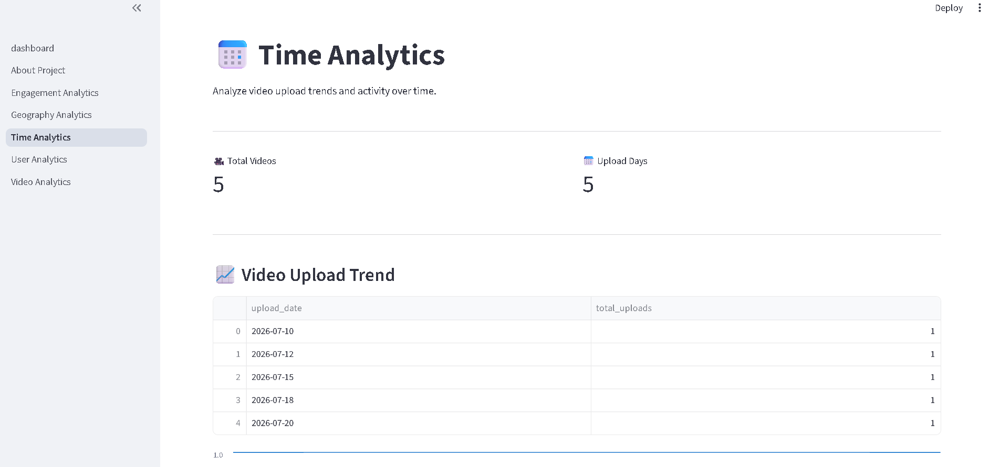
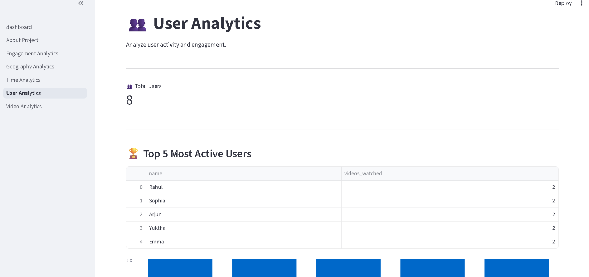
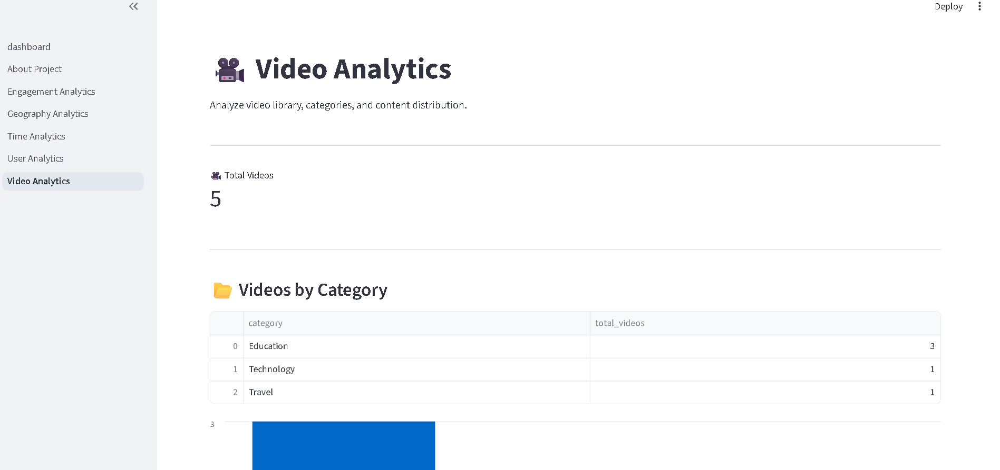

# 📊 StreamSphere Analytics Dashboard

> **Transforming Video Data into Actionable Insights**

An end-to-end **Product Analytics Dashboard** built using **Python, Streamlit, PostgreSQL, Pandas, and Plotly**. The application provides interactive dashboards to analyze video performance, user engagement, content trends, and geographical insights.

---

## 🚀 Features

- 📈 Interactive Product Analytics Dashboard
- 🎥 Video Performance Analysis
- 👥 User Engagement Analytics
- 🌍 Country-wise Analytics
- 📅 Upload Trend Analysis
- 📂 Category-wise Insights
- 🔍 Dynamic Filters (Country, Video, Category)
- 📊 KPI Cards
- 📥 Export Data as CSV
- 📱 Responsive Streamlit Interface

---

## 🛠 Tech Stack

| Technology | Purpose |
|------------|---------|
| Python | Backend Logic |
| Streamlit | Web Dashboard |
| PostgreSQL | Database |
| SQL | Data Queries |
| Pandas | Data Processing |
| Plotly | Interactive Charts |

---

## 📂 Project Structure

```text
StreamSphere-Analytics/
│
├── assets/
│   ├── logo.png
│   ├── dashboard.png
│   ├── about_project.png
│   ├── engagement.png
│   ├── geography.png
│   ├── time.png
│   ├── user.png
│   └── video.png
│
├── pages/
│   ├── About_Project.py
│   ├── Engagement_Analytics.py
│   ├── Geography_Analytics.py
│   ├── Time_Analytics.py
│   ├── User_Analytics.py
│   └── Video_Analytics.py
│
├── dashboard.py
├── app.py
├── db_connection.py
├── requirements.txt
├── README.md
├── LICENSE
└── .gitignore
```

---

## 📸 Dashboard Preview

> Add your screenshots here after uploading them to the `assets` folder.

### Dashboard




### Engagement Analytics



### Geography Analytics



### Time Analytics



### User Analytics



### Video Analytics



---

## 🗄 Database

The project uses a PostgreSQL database with the following tables:

- Users
- Videos
- Watch History

---

## ⚙ Installation

```bash
git clone https://github.com/YukthaK215/StreamSphere-Analytics.git

cd StreamSphere-Analytics

pip install -r requirements.txt

streamlit run dashboard.py
```

---

## 🎯 Key Features

- Interactive KPIs
- Dynamic filtering
- Business insights
- Downloadable reports
- Modern dashboard design
- Multi-page analytics

---

## 🚀 Future Enhancements

- User Authentication
- Predictive Analytics
- Machine Learning Recommendations
- Cloud Deployment
- Real-time Data Streaming
- Admin Dashboard

---

## 👩‍💻 Author

**Yuktha K**

Bachelor of Engineering (Electronics & Communication)

Interested in Data Analytics, AI, and Software Development.

---

## 📄 License

This project is licensed under the MIT License.
